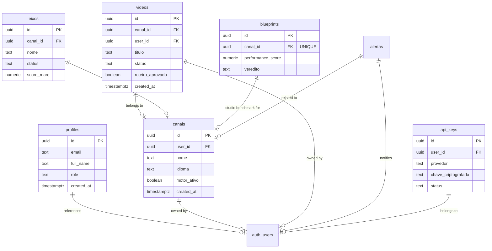

# Supabase Schema Documentation

**Projeto:** AD_LABS  
**Versão:** 1.0  
**Última Atualização:** 2026-04-05  

## 📊 Entity Relationship Diagram

## 🗄️ Table Dictionary

### 1. `profiles`
Espelho de `auth.users` para armazenamento de metadados de perfil público e permissões administrativas.
- **id**: UUID, PK, referência a `auth.users.id`.
- **role**: Role do sistema (`admin`, `editor`, `viewer`). Padrão: `admin`.
- **updated_at**: Atualização manual (Trigger ausente).

### 2. `canais`
Núcleo da multi-tenancy. Define as configurações de cada canal de conteúdo e conexões OAuth.
- **user_id**: Proprietário do canal.
- **mare_status**: Estado no ecossistema (testando/ativa/pausada).
- **Auto-Refill Motor**: Configurações de automação para estoque mínimo de planejamento/produção.

### 3. `videos`
Entidade operacional principal. Rastreia o progresso da produção de cada vídeo.
- **status**: Lifecycle do vídeo (`planejamento` -> `producao` -> `pronto` -> `agendado` -> `publicado`).
- **Checklist Operacional**: 7 flags booleanas indicando conclusão de etapas (título, áudio, imagens, etc).
- **Audit Trail**: Campos `aprovado_por` e `aprovado_via` garantem rastreabilidade de decisões (Humano vs Automação).

### 4. `eixos`
Configurações estratégicas do "Motor de Marés". Define personas, arquetipos e regras narrativas.
- **score_mare**: Métrica de performance do eixo dentro do nicho.
- **taxa_concorrencia**: Qualitativo (alta, media, baixa).

### 5. `blueprints`
Análise de benchmark e estrutura de sucesso (Studio).
- **performance_score**: Pontuação baseada em métricas externas.
- **formula_emocional**: Texto descritivo da estrutura narrativa de sucesso.

### 6. `alertas`
Sistema de notificações push/dashboard.
- **user_id**: Alvo do alerta.
- **tipo**: Severidade (`erro`, `aviso`, `mare`, `info`).

### 7. `api_keys`
Cofre de chaves de API externas (YouTube, OpenAI, ElevenLabs, etc).
- **chave_criptografada**: Deve ser tratada com nível máximo de segurança.

## 🔒 Row Level Security (RLS)

A política global é de **Isolamento de Tenant**. Cada linha possui `user_id` ou referência direta a uma tabela que possui, garantindo que um usuário nunca acesse dados de outro.

| Tabela | RLS Status | Política |
|--------|------------|----------|
| `profiles` | 🟢 Enabled | `id = auth.uid()` |
| `canais` | 🟢 Enabled | `user_id = auth.uid()` |
| `videos` | 🟢 Enabled | `user_id = auth.uid()` |
| `eixos` | 🟢 Enabled | `canal_id` pertence a `user_id = auth.uid()` |
| `blueprints` | 🟢 Enabled | `canal_id` pertence a `user_id = auth.uid()` |
| `api_keys` | 🟢 Enabled | `user_id = auth.uid()` |

## ⚙️ Triggers & Functions

- `handle_new_user()`: Automático na criação de usuário via Auth Hook.
- `set_updated_at()`: Atualiza `updated_at` automaticamente para `canais`, `videos`, `eixos` e `blueprints`.
